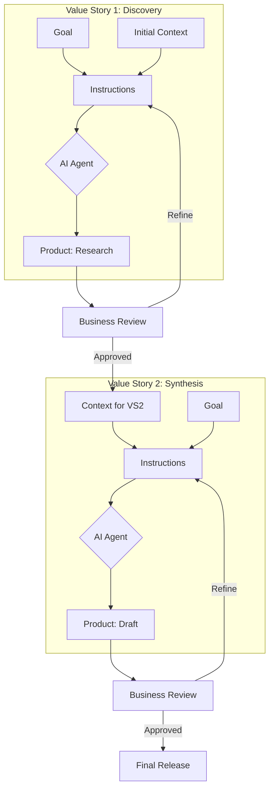

# AVS Architecture: The Cognitive Assembly Line

This document elaborates on how individual Value Stories are sequenced to create an **Agentic Value Stream (AVS)**.

## 1. The Handoff Logic: "Product to Context"

The fundamental principle of an AVS is that **Value is Cumulative**. In a traditional "Information Hunt" environment, context is lost between tasks. In an AVS, the output of one story is engineered to be the input for the next.

- **Value Story A (The Researcher):** Produces a "Discovery Product."

- **Handoff:** The "Discovery Product" is appended to the Mandatory Context of Story B.

- **Value Story B (The Architect):** Uses that context to produce a "Design Product."

## 2. Diagram: The Agentic Value Stream Flow

This diagram depicts a standard AVS flow, including the Business Review quality gates and the Recursive Feedback Loops.

## 3. Orchestration Patterns

In the **Agentic Age**, an AVS can take three primary forms:

### A. Linear (Sequential)

The simplest form. Story A flows to Story B. Best for predictable, repetitive cognitive work (e.g., Weekly Reporting).

### B. The "Saga" (Recursive)

A Value Story that includes a "Reflection" step. If the AI Agent's product doesn't meet the Success Criteria in the Goal, the instructions tell it to loop back and try again with the previous failure as "Negative Context" [cite: 3.2.3].

### C. Human-in-the-Loop (Hybrid)

A stream where specific Value Stories are assigned to Human Agents (Strategy/Review) and others to AI Agents (Production/Analysis). The AVS ensures that when the AI finishes, the Human is presented with the Product and the Full Context immediately, eliminating the "5-15 hour hunt" for the reviewer.

### 4. Why This Multiplies Value

By modularizing the stream, you can swap out Agents without breaking the system. If a better LLM is released, you simply update the Agentic-Agent in the Story; the Goal, Instructions, and Context remain the organizational IP that provides the stability.