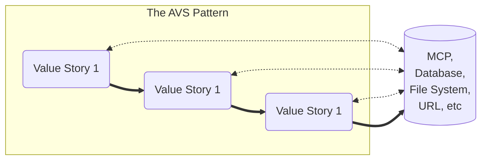
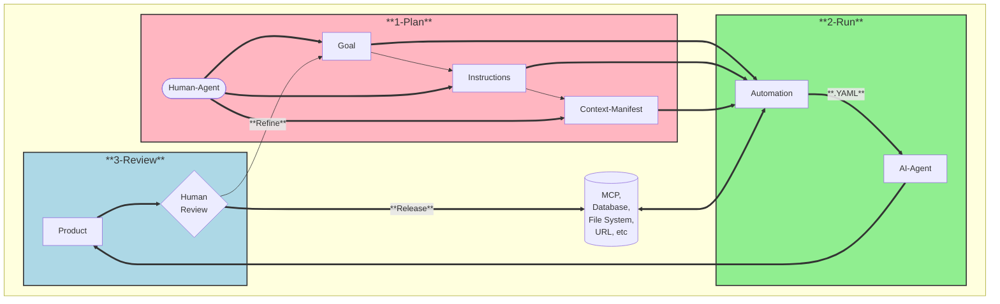
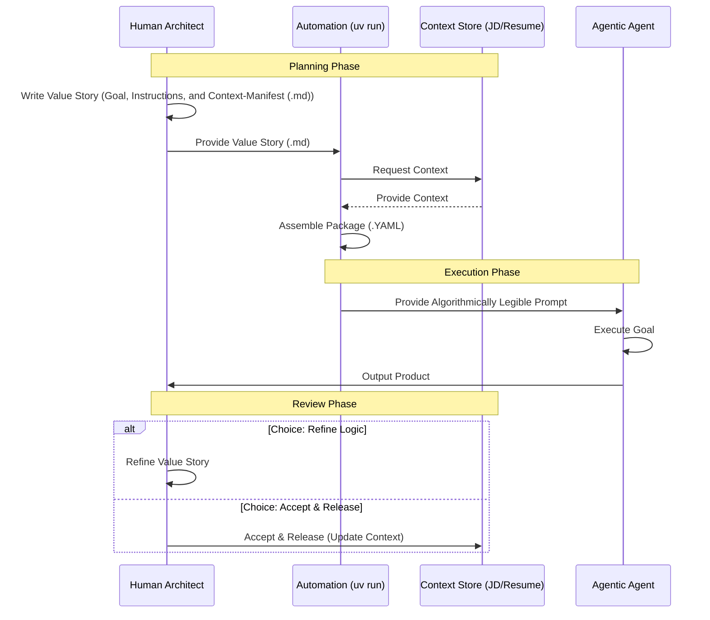

# AVS Value Story

## A Framework for Multiplying Human Value in the Era of Autonomous Orchestration.

Developed by **Patrick Heaney**, this framework provides a rigorous methodological shift from "automating work" to **multiplying value** by externalizing tacit knowledge into **Algorithmically Legible Instructions**.

## 🚀 **The Problem: The Information Hunt**

The current crisis in knowledge work is characterized by the **"5–15 hour information hunt"**—time lost every week by workers simply trying to gather the context needed to do their actual jobs [cite: 1.1, 2.1]. This **"context blindness"** is the primary reason AI deployments fail, lead to hallucinations, or require excessive human oversight [cite: 2.4, 6.2].

# 💡 **The Solution: Agentic Value Streams (AVS)**

The Agentic Value Stream (AVS) tracks the flow of agency and decision-making rather than just static data [cite: 1.1]. It organizes the capabilities of Large Language Models (LLMs) into a **cascading, iterative, and cumulative sequence** of value creation centered around the Value Story [cite: 1.1].



## Core Definitions

**Value Story**: The atomic unit of agentic work. It is a self-contained module comprising a **Goal** (Outcome), **Instructions** (Algorithm), and **Context-Manifest** (Data) [cite: 2.1.3].

**Algorithmically Legible Instructions**: Precise enough for an AI-Agent to execute with zero "context blindness," yet semantically clear enough for Human-Agents to oversee and audit [cite: 2.2.2].

**Context-Manifest**: A mandatory component that shifts the burden of information retrieval from "runtime execution" to "design-time definition," effectively eliminating the "Information Hunt" [cite: 2.2.3].

# 🛠️ The Value Story 
This diagram illustrates the **Value Story** lifecycle: Plan (Human), Run (Agent), and Review (Human).

## The Strategic Shift

Under the **AVS Framework**, the highest-value human contributions complete the shift higher level thinking. Users shift from "doing the work" to strategicly generating and improving the goals, instructions, and context, used by Agentic-AI-Agents to produce the product. This moves the human architect from the role of a "task-manager" to a **"Orchestrator of Agency"** and moves the Agentic AI Agent from a "task-doer" to a **"force multiplier."**

## 🤝 Getting Started

Explore the Templates: Check the /templates folder for YAML schemas for creating your first Value Story.

Integrate with MCP: This repository includes implementation guides for the Model Context Protocol (MCP) to provide mandatory context-manifest to your agents [cite: 7.1].

Contribute: Fork this repo to share your own "Algorithmically Legible" instructions for common industry value streams.

## ✨ Illustrative Example: Tailored Resume Generation

To demonstrate the power of Agentic Value Streams, consider the task of generating a tailored resume for a specific job application. This complex task can be broken down into a sequence of interconnected Value Stories:

### 1. VS-001: Analysis & Strategy

- **Goal:** Understand the job description and the candidate's existing resume to identify key skills, experiences, and keywords for optimal matching.
- **Instructions:**
    *   Parse job description to extract required skills, keywords, and responsibilities.
    *   Parse candidate's raw resume to identify relevant experience, education, and achievements.
    *   Perform a gap analysis between job requirements and candidate profile.
    *   Develop a strategic plan for resume tailoring, including prioritization of content and keyword integration.
- **Context-Manifest:** Job description (URL or text), Candidate's raw resume (PDF or text).
- **Product:** Strategy Report (The "Algorithm" for the next step).  

### 2. VS-002: Resume Generation

- **Goal:** Produce a draft resume tailored to the specific job application, following the strategic plan.
- **Instructions:**
    *   Select and prioritize relevant sections and bullet points from the candidate's raw resume based on the strategic plan.
    *   Rewrite/rephrase existing bullet points to incorporate job-specific keywords and align with the job description's language.
    *   Ensure resume adheres to best practices for formatting and readability.
- **Context-Manifest:** Output from VS-001 (strategic plan), Candidate's raw resume, Resume formatting guidelines.
- **Product:**  Tailored Resume Draft
### 3. VS-003: Audit (Hallucination Detection)

- **Goal:** Conduct a forensic audit of the tailored resume to ensure zero fabrication of facts. Identify and report any claims that deviate from the factual ground truth of the raw resume.
- **Instructions:**
    *   Compare tailored resume against job description for keyword density and thematic alignment.
    *   Check for clarity, conciseness, and absence of generic language.
    *   Identify any remaining gaps or areas for improvement.
    *   Suggest specific revisions to optimize the resume further.
- **Context-Manifest:** Tailored resume (draft), Original job description, Best practices for resume optimization.
- **Product:**  Audit Report & Finalized Resume.

### The Automation Step: Assembling the AI Prompt

Within each Value Story in the AVS framework, "Automation" isn't the AI thinking; it is the **assembly line** that builds the perfect prompt.

To multiply human value, we don't just "ask the AI." We automate assembling the prompt by combining:
1.  **The Goal:** The specific outcome defined by the human architect.
2.  **The Instructions:** The "Algorithmically Legible" logic for *how* to do the work.
3.  **The Context-Manifest:** The specific data (e.g., `job-description.md` and `raw-resume.md`) needed to prevent hallucination.

This process generates a single, auditable package (the Value Story YAML) that serves as the **Context-Rich, Algorithmically Legible Prompt** for the Agent.

*👉 Check the `/illustrative-example` folder to see the input files and the resulting assembled YAML.*

### Orchestration Sequence

This sequence diagram illustrates the temporal hand-off between the Human Architect, the Automation script (using uv), and the AI Agent for each story in the stream.



# Getting Started

This repository uses uv for lightning-fast project and dependency management.

## 1. Install and Setup
```
git clone [https://github.com/PatrickHeaney/avs-value-story.git](https://github.com/PatrickHeaney/avs-value-story.git)
cd avs-value-story
```
 ## 2. Run the Example
The `assemble_prompt.py` script acts as the Automation layer, combining your human logic and context files into a single, context-rich YAML prompt.

### **Step 1. Assemble VS-001 (Analysis & Strategy)**
**Plan:** Review and update the input files (`job_description.md`, `raw-resume.md`) and the logic definition (`VS-001-logic-analysis.md`) to ensure the goals and constraints are accurate.

**Run:**
- **Assemble:**
```bash
    uv run illustrative-example/assemble_prompt.py 
    --logic illustrative-example/VS-001-logic-analysis.md 
    --output VS-001-assembled.yaml
```
- **Execute:**
    - **Web UI (Claude.ai / ChatGPT):** Open `VS-001-assembled.yaml`, copy the entire text, and paste it into the chat.
    - **Agentic IDE (Cursor / Windsurf / Claude Dev):** Open the file and ask the agent: "`Execute the goal in this Value Story and save the result to strategy_report.md`"

**Review:** Audit the Strategic Plan. Once satisfied, save it as `strategy_report.md` in the `illustrative-example/` folder to feed the next story.

### **Step 2: Generate the Tailored Resume (VS-002)**

**Plan:** Review the `strategy_report.md` (Product of VS-001) and ensure the `VS-002-logic-generation.md` instructions correctly prioritize the identified strategy.

**Run:**
- **Assemble:**
```bash
    uv run illustrative-example/assemble_prompt.py \
    --logic illustrative-example/VS-002-logic-generation.md \
    --output VS-002-assembled.yaml
```
- **Execute:** Provide the text of VS-002-assembled.yaml to your AI for execution.

**Review:** Validate the Tailored Resume Draft. Save the result as `tailored_resume_draft.md`.

### **Step 3: Conduct the Hallucination Audit (VS-003)**

**Plan:** Review the `tailored_resume_draft.md` and the `VS-003-logic-audit.md` definition to ensure the forensic "Red-Teaming" criteria are exhaustive.

**Run:** 
- **Assemble:**
```bash
    uv run illustrative-example/assemble_prompt.py \
    --logic illustrative-example/VS-003-logic-audit.md \
    --output VS-003-assembled.yaml
```
- **Execute:** Provide the text of `VS-003-assembled.yaml` to your AI.

**Review:** Either `Refine` the input files of step 1 and repeat the Value Stream or `Accept` the Final Audit Report & Verified Resume to complete the AVS.

## 🏅 About the Author

Patrick Heaney brings over 20 years of experience in high-stakes program management and the intelligence community [cite: user_context].

Recipient of two "US Army Top 10 Inventions" awards for systems that drastically reduced friction and saved lives in combat environments [cite: user_context].

Architect of the AVS Framework, designed to solve the structural "context gap" in modern enterprise AI [cite: 1.1, 6.2].

## 📄 License & Attribution

This work is licensed under the Creative Commons Attribution-ShareAlike 4.0 International (CC BY-SA 4.0).

### How to Cite

If you utilize this framework, templates, or logic in a professional, academic, or commercial context, please provide attribution as follows:

Heaney, P. (2025). AVS Value Story: A Framework for Autonomous Orchestration. GitHub: PatrickHeaney/avs-value-story.

