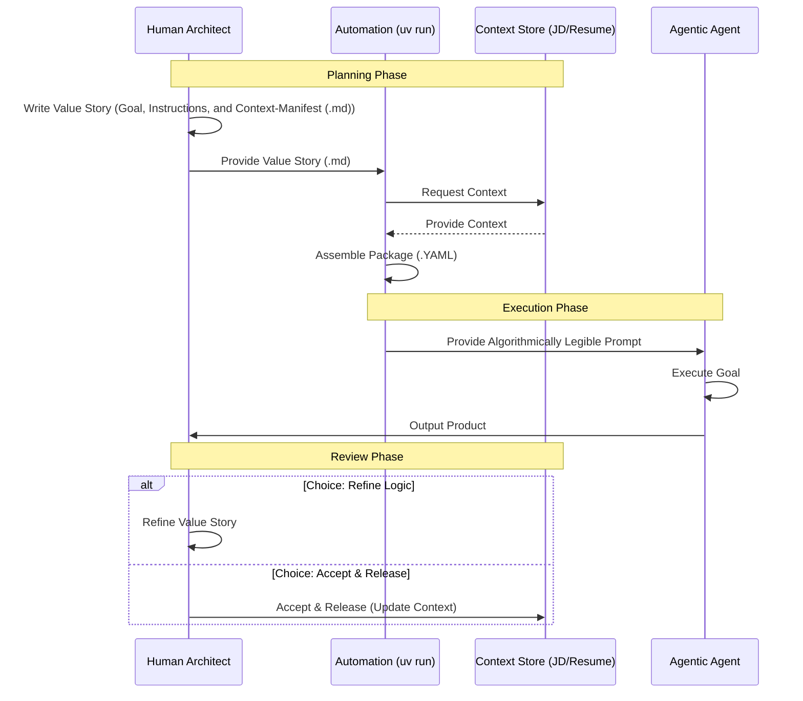

## 🤝 Getting Started

This project uses `uv` for ultra-fast, reproducible Python environment management.

Contribute: Fork this repo to share your own "Algorithmically Legible" instructions for common industry value streams.

## ✨ Illustrative Example: Tailored Resume Generation

To demonstrate the power of Agentic Value Streams, consider the task of generating a tailored resume for a specific job application. This complex task can be broken down into a sequence of interconnected Value Stories:

### 1. VS-001: Analysis & Strategy

- **Goal:** Understand the job description and the candidate's existing resume to identify key skills, experiences, and keywords for optimal matching.
- **Instructions:**
    *   Parse job description to extract required skills, keywords, and responsibilities.
    *   Parse candidate's raw resume to identify relevant experience, education, and achievements.
    *   Perform a gap analysis between job requirements and candidate profile.
    *   Develop a strategic plan for resume tailoring, including prioritization of content and keyword integration.
- **Context-Manifest:** Job description (URL or text), Candidate's raw resume (PDF or text).
- **Product:** Strategy Report (The "Algorithm" for the next step).  

### 2. VS-002: Resume Generation

- **Goal:** Produce a draft resume tailored to the specific job application, following the strategic plan.
- **Instructions:**
    *   Select and prioritize relevant sections and bullet points from the candidate's raw resume based on the strategic plan.
    *   Rewrite/rephrase existing bullet points to incorporate job-specific keywords and align with the job description's language.
    *   Ensure resume adheres to best practices for formatting and readability.
- **Context-Manifest:** Output from VS-001 (strategic plan), Candidate's raw resume, Resume formatting guidelines.
- **Product:**  Tailored Resume Draft
### 3. VS-003: Audit (Hallucination Detection)

- **Goal:** Conduct a forensic audit of the tailored resume to ensure zero fabrication of facts. Identify and report any claims that deviate from the factual ground truth of the raw resume.
- **Instructions:**
    *   Compare tailored resume against job description for keyword density and thematic alignment.
    *   Check for clarity, conciseness, and absence of generic language.
    *   Identify any remaining gaps or areas for improvement.
    *   Suggest specific revisions to optimize the resume further.
- **Context-Manifest:** Tailored resume (draft), Original job description, Best practices for resume optimization.
- **Product:**  Audit Report & Finalized Resume.

### The Automation Step: Assembling the AI Prompt

Within each Value Story in the AVS framework, "Automation" isn't the AI thinking; it is the **assembly line** that builds the perfect prompt.

To multiply human value, we don't just "ask the AI." We automate assembling the prompt by combining:
1.  **The Goal:** The specific outcome defined by the human architect.
2.  **The Instructions:** The "Algorithmically Legible" logic for *how* to do the work.
3.  **The Context-Manifest:** The specific data (e.g., `job-description.md` and `raw-resume.md`) needed to prevent hallucination.

This process generates a single, auditable package (the Value Story YAML) that serves as the **Context-Rich, Algorithmically Legible Prompt** for the Agent.

*👉 Check the `/illustrative-example` folder to see the input files and the resulting assembled YAML.*

### Orchestration Sequence

This sequence diagram illustrates the temporal hand-off between the Human Architect, the Automation script (using uv), and the AI Agent for each story in the stream.

